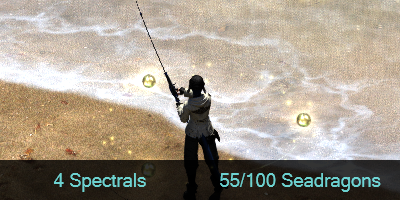
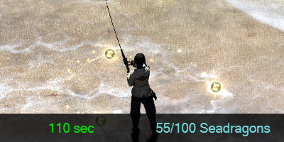
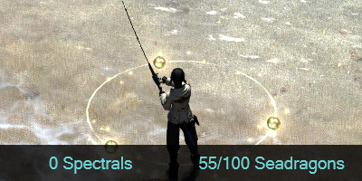

# Features
<h2 align="center">

Automatically tracks the required fish for achievements.
 

 

Tracks the current time on the spectral current.
 

 

Resets the spectral fish count when entering a new zone.
 

</h2>

 

# Limitations and Bugs
* These triggers do use C# code. The code is used to calculate the current route. If you're worried about the code you can review it yourself in the [TriggernometryOceanFishing.cs](https://github.com/austinglines42/TriggernometryOceanFishing/blob/v1.0.1/TriggernometryOceanFishing.cs) file. (I'm planning to remove in the future but at the current moment it simplifies the process a lot)
* Does not track players more than 20 yalms away.
* Does not track blue fish.
* Some jankyness can happen if you have a spectral that ends early into an early spectral.

 

# How to Install
1. Download the newest XML file from the [releases page](https://github.com/austinglines42/TriggernometryOceanFishing/releases).
2. Within Triggernometry select the folder you would like to import it into. Then click the "Import" button within the Triggernometry tab.
3. Select "Load from file or URI" then select the file that you downloaded, then click "Next >".
4. It will give you a warning about arbitrary code execution. Just click Import. It is safe to use but you can read more about it in the Limitations and Bugs section.
5. It is not working and ready to go! Happy Fishing!

 

# Contact Me
Best way to contact me is through discord: Aubis2#1355